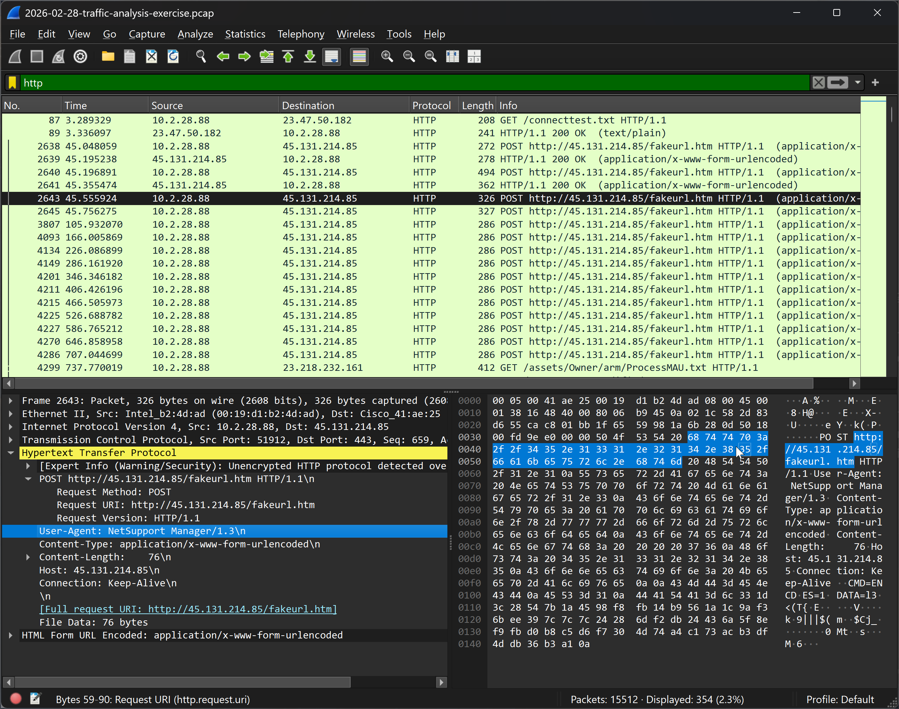
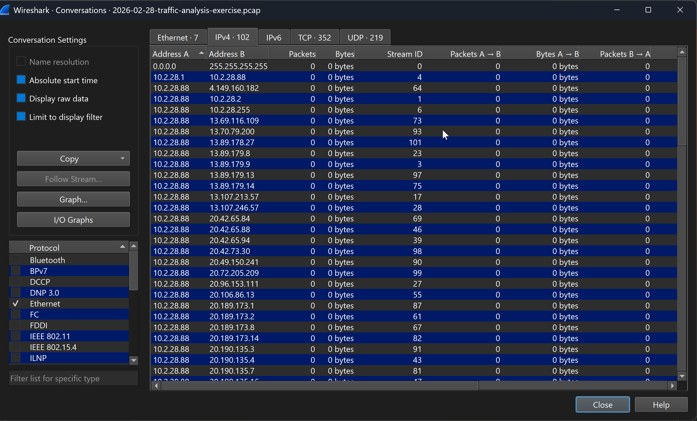
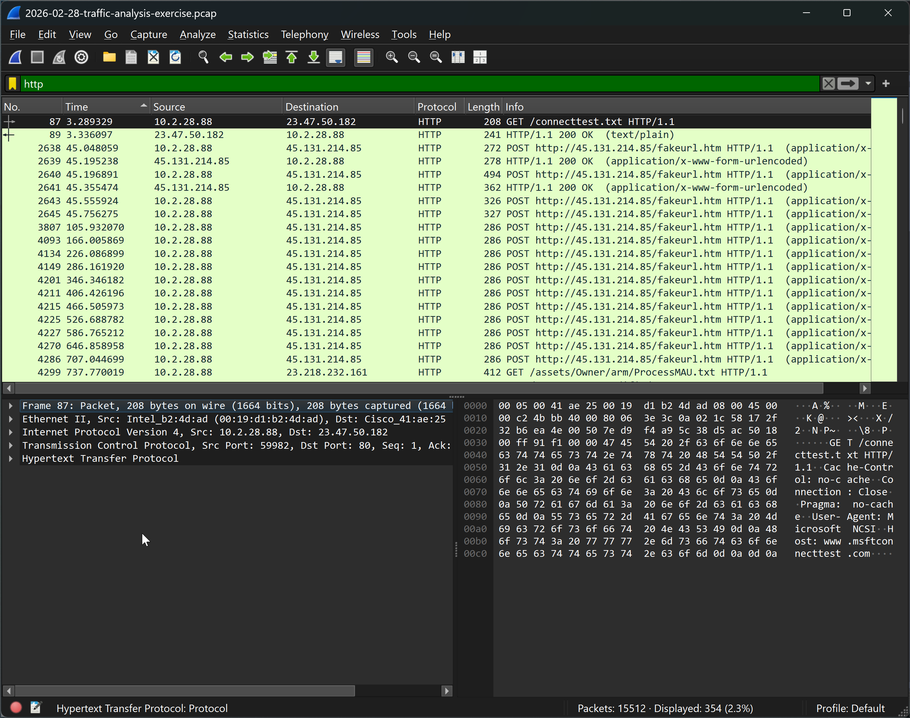

# NetSupport Manager RAT Malware Traffic Analysis

This project documents my investigation of a simulated NetSupport RAT infection using Wireshark. By analyzing a packet capture (PCAP), I identified the compromised host, traced its communication with a command-and-control (C2) server,  indicators of compromise (IOCs) with threat intelligence, and reconstructed the attack timeline to understand the malware's behavior.

## Investigation Objectives

The primary objectives of this investigation were to:
- Identify the compromised host withing the network traffic.
- Determine the malware's command-and-control (C2) infrastructure.
- Identify indicators of compromise(IOCs).
- Reconstruct the attack timeline from the packet capture.
- Recommend remediation actions based on the findings.

## Environment

| Item | Value |
|------ | ------|
|Analysis Tool | Wireshark |
| Evidence File | `2026-02-28-traffic-analysis.pcap` |
| Malware Family | NetSupport Manager RAT |
| Victim Host | `10.2.28.88` |
| Primary C2 Server | `45.131.214.85` |
| Protocols Observed | TCP, HTTP, TLS 1.2 |
| Operating System | Windows |

## Victim Identification

The investigation began by identifying the internal host responsible for suspicious outbound network activity. Filtering the packet capture for the encrypted HTTPS traffic (`tcp.port == 443`) revealed repeated communication between the interanl workstation `10.2.28.88` and the external IP address `13.89.179.9`.

At this stage of the investigation, the HTTPS communication alone was not sufficient to conclude that the host was compromised, as encrypted traffic over port 443 is common in enterprise environments. However, the repeated outbound conncections established the system as the primary host requiring further investigation. 

**Finding:** Internal host **10.2.28.88** was identified as the primary system of interest and selected for deeper investigation.

*Figure 1. Initial traffic analysis showing the internal host (10.2.28.88) communicating with the external IP address (13.89.179.9) over TCP port 443. At this stage, encrypted HTTPS traffic alone was not sufficient to confirm compromise but identified the primary system requiring further investigation.*
  

## Command-and-Control (C2) Traffic Analysis

After identifying the suspicious internal host, the investigation focused on determining the remote system acting as the malware's command-and-control (C2) server. Inspection of the outbound connections revealed repeated communication between the victim host **10.2.28.88** and the external IP address **45.131.214.85**.

Unlike the initial HTTPS traffic observed during victim identification, this communication was consistent throughout the packet capture and matched the behaviour expected of a remote access trojan maintaining contact with its operator. The repeated network sessions indicated that **45.131.214.85** was functioning as the primary C2 infrastructure used by the malware. 

**Finding:** External IP address **45.131.214.85** was identified as the primary command-and-control (C2) server communicating with the infected host.

*Figure 2. HTTP POST requests from the infected workstation (10.2.28.88) to the external IP address (45.131.214.85), including the `/fakeurl.htm` endpoint and NetSupport Manager User-Agent, confirming communication with the malware's command-and-control (C2) server.*

## Indicators of Compromise (IOCs)

The investigation identified the following indicators of compromise associated with the NetSupport Manager RAT infection.

| Indicator Type | Value | Description |
|---------------|-------|-------------|
| Victim Host | 10.2.28.88 | Compromised internal workstation |
| Primary C2 IP | 45.131.214.85 | Command-and-control (C2) server |
| HTTP URI | http://45.131.214.85/fakeurl.htm | HTTP endpoint used by the malware |
| User-Agent | NetSupport Manager/1.3 | Malware HTTP User-Agent string |
| Protocols | HTTP, HTTPS (TLS 1.2) | Network communication protocols |
| TCP Ports | 80, 443 | Communication ports observed |

**Finding:** These network artifacts confirmed that the infected workstation maintained communication with the NetSupport Manager RAT command-and-control infrastructure.

*Figure 3. Wireshark Conversations view highlighting the infected host (10.2.28.88) communicating with multiple external IP addresses, including the primary command-and-control server (45.131.214.85).*

## Attack Timeline

The packet capture revealed a sequence of events consistent with a NetSupport Manager RAT infection. Analysis of network traffic established the progression from initial outbound communication to sustained command-and-control activity.

| Time | Activity | Evidence |
|------|----------|----------|
| 00:00:03 | Victim host (10.2.28.88) initiated outbound HTTP request to `connecttest.txt` | Normal Windows connectivity check |
| 00:00:40 | First outbound connection to 45.131.214.85 | Initial communication with suspected C2 server |
| 00:01:54 | HTTP POST request to `/fakeurl.htm` | Malware beacon establishing C2 communications |
| 00:00:45–00:12:17 | Repeated HTTP POST requests with NetSupport Manager User-Agent | Continuous command-and-control activity |

**Finding:** The timeline demonstrated an initial outbound connection followed by repeated HTTP POST requests to the remote infrastructure, confirming persistent communication between the infected workstation and the command-and-control server.

*Figure 4. Timeline of network activity showing the initial outbound connection followed by persistent HTTP POST requests between the infected workstation (10.2.28.88) and the NetSupport Manager command-and-control server.*
